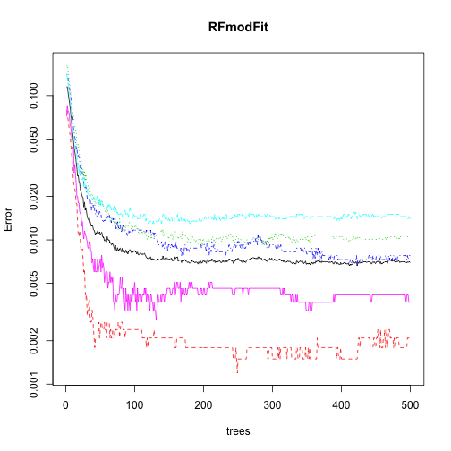
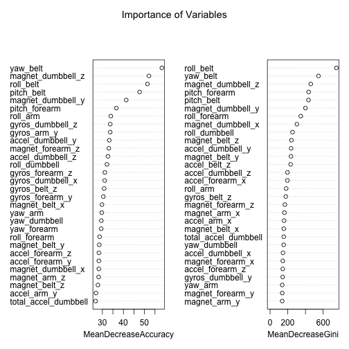

First we will load the required libraries

```r
#setwd("~/Documents/Coursera/Machine Learning")
require(Hmisc)
require(caret)
require(ggplot2)
library(rattle)
library(rpart)
library(randomForest)
```
Load training and test data


```r
trainUrl <- "http://d396qusza40orc.cloudfront.net/predmachlearn/pml-training.csv"
testUrl <- "http://d396qusza40orc.cloudfront.net/predmachlearn/pml-testing.csv"
training <- read.csv(url(trainUrl), na.strings=c("NA","#DIV/0!",""))
testing <- read.csv(url(testUrl), na.strings=c("NA","#DIV/0!",""))
```
Preprocessing begins next

```r
training_nas <- training[,(colSums(is.na(training)) == 0)]
testing_nas <- testing[,(colSums(is.na(testing)) == 0)]
```
Remove zero variance.

```r
zvar <- nearZeroVar(training_nas,saveMetrics=TRUE)
trainingNZ<- training_nas[,!zvar$nzv]
testingNZ <- testing_nas[,!zvar$nzv]
```

```r
#metaData_train <- c("user_name","raw_timestamp_part_1","raw_timestamp_part_2","cvtd_timestamp","num_window","problem_id")
training_clean <- trainingNZ[, c(7:59)]
testing_clean <- testingNZ[, c(7:59)]
dim(training_clean)
```

```
## [1] 19622    53
```

```r
dim(testing_clean)
```

```
## [1] 20 53
```
#Cross-validation
The next section partitions the training data into a training subset and a validation subset which is named Testing_A, not to be confused with the downloaded testing dataset of 20 observations used to generate the test files at the end.
The Random Forest method has its own internal cross-validation algorithms which protect against overfitting.

```r
inTrain <- createDataPartition(y=training$classe, p=0.6, list=FALSE)
training_A <- training_clean[inTrain, ]
testing_A <- training_clean[-inTrain, ]
dim(training_A)
```

```
## [1] 11776    53
```

```r
dim(testing_A)
```

```
## [1] 7846   53
```
#Model Building
The next section builds the random forest model and then uses it to predict the "classe" variable in the validation partition.
It is then used to generate a confusion matrix which will provide measures of uncertainty


```r
RFmodFit <- randomForest(classe ~. , data=training_A, importance=TRUE)

#Predicting:

predictionsRF1 <- predict(RFmodFit, testing_A, type = "class")

#The acid test:  Generating a confusion matrix
confusionMatrix(predictionsRF1, testing_A$classe)
```

```
## Confusion Matrix and Statistics
## 
##           Reference
## Prediction    A    B    C    D    E
##          A 2230   10    0    0    0
##          B    1 1506   11    0    0
##          C    0    2 1352   31    1
##          D    0    0    5 1255    0
##          E    1    0    0    0 1441
## 
## Overall Statistics
##                                        
##                Accuracy : 0.992        
##                  95% CI : (0.99, 0.994)
##     No Information Rate : 0.284        
##     P-Value [Acc > NIR] : <2e-16       
##                                        
##                   Kappa : 0.99         
##  Mcnemar's Test P-Value : NA           
## 
## Statistics by Class:
## 
##                      Class: A Class: B Class: C Class: D Class: E
## Sensitivity             0.999    0.992    0.988    0.976    0.999
## Specificity             0.998    0.998    0.995    0.999    1.000
## Pos Pred Value          0.996    0.992    0.975    0.996    0.999
## Neg Pred Value          1.000    0.998    0.998    0.995    1.000
## Prevalence              0.284    0.193    0.174    0.164    0.184
## Detection Rate          0.284    0.192    0.172    0.160    0.184
## Detection Prevalence    0.285    0.193    0.177    0.161    0.184
## Balanced Accuracy       0.999    0.995    0.992    0.988    1.000
```
# The Out of Sample test file is applied to the model
The RandomForest model constructed above is now applied to the final test data set
The results are plotted.

```r
predictionsRF2<-predict(RFmodFit,testing_clean)
```

```r
plot(RFmodFit, log="y")
```

```
## Warning: 247 y values <= 0 omitted from logarithmic plot
```

 

```r
varImpPlot(RFmodFit, main="Importance of Variables")
```

 


```r
pml_write_files = function(x){
  n = length(x)
  for(i in 1:n){
    filename = paste0("problem_id_",i,".txt")
    write.table(x[i],file=filename,quote=FALSE,row.names=FALSE,col.names=FALSE)
  }
}
pml_write_files(predictionsRF2)
```
